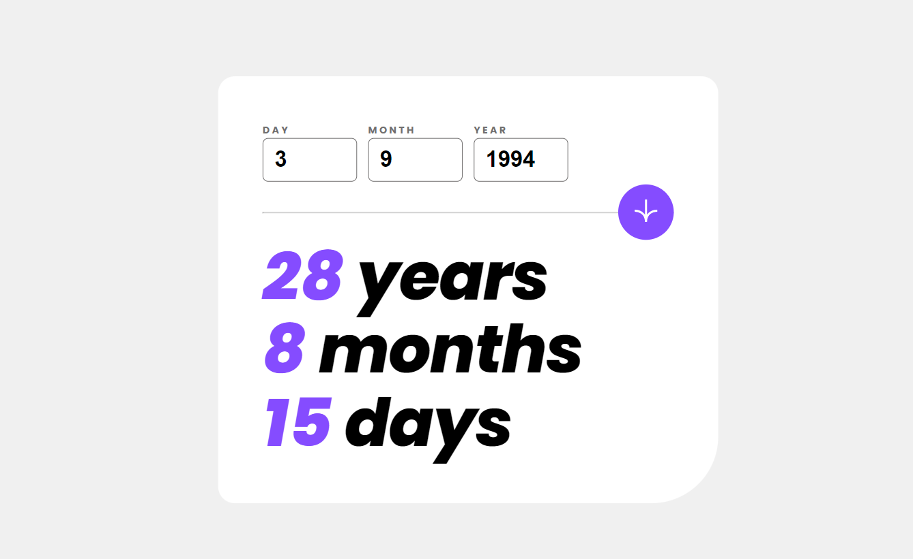

# Frontend Mentor - Age calculator app solution

This is a solution to the [Age calculator app challenge on Frontend Mentor](https://www.frontendmentor.io/challenges/age-calculator-app-dF9DFFpj-Q). Frontend Mentor challenges help you improve your coding skills by building realistic projects. 

## Table of contents

- [Frontend Mentor - Age calculator app solution](#frontend-mentor---age-calculator-app-solution)
  - [Table of contents](#table-of-contents)
  - [Overview](#overview)
    - [The challenge](#the-challenge)
    - [Screenshot](#screenshot)
    - [Links](#links)
  - [My process](#my-process)
    - [Built with](#built-with)
    - [What I learned](#what-i-learned)
    - [Continued development](#continued-development)
    - [Useful resources](#useful-resources)
  - [Author](#author)

## Overview

### The challenge

Users should be able to:

- View an age in years, months, and days after submitting a valid date through the form
- Receive validation errors if:
  - Any field is empty when the form is submitted
  - The day number is not between 1-31
  - The month number is not between 1-12
  - The year is in the future
  - The date is invalid e.g. 31/04/1991 (there are 30 days in April)
- View the optimal layout for the interface depending on their device's screen size
- See hover and focus states for all interactive elements on the page

### Screenshot

### Links

- Solution URL: [https://oroszlanolo.github.io/FM-age-calculator/](https://oroszlanolo.github.io/FM-age-calculator/)
- Live Site URL: [https://github.com/oroszlanolo/FM-age-calculator](https://github.com/oroszlanolo/FM-age-calculator)

## My process

### Built with

- Semantic HTML5 markup
- CSS custom properties
- CSS Grid
- Mobile-first workflow
- [Angular](https://angular.io/) - JS framework

### What I learned

I am learning angular right now, and in this excercise I have learned about forms and form validation.

### Continued development

What I am not satisfied is the long template expressions in my form. I would've liked to create some variables for them in the component class, but I am unsure how to do it. Also I am unsure about the working of the Angular change detection. I will further explore this area in the future.

### Useful resources

- [CSS Grid tutorial video from Kevin Powell](https://www.youtube.com/watch?v=rg7Fvvl3taU&t=1674s&ab_channel=KevinPowell) - I haven't used grid much yet, but this video helped me a lot.

- [Angular Reactive Forms video from Monsterlessons Academy](https://www.youtube.com/watch?v=U9Xo0wXZIAg&ab_channel=MonsterlessonsAcademy) - Helped me understanding the basic concepts of Angular reactive forms and input validation.

## Author

- Frontend Mentor - [@oroszlanolo](https://www.frontendmentor.io/profile/oroszlanolo)
- Github - [@oroszlanolo](https://github.com/oroszlanolo)

